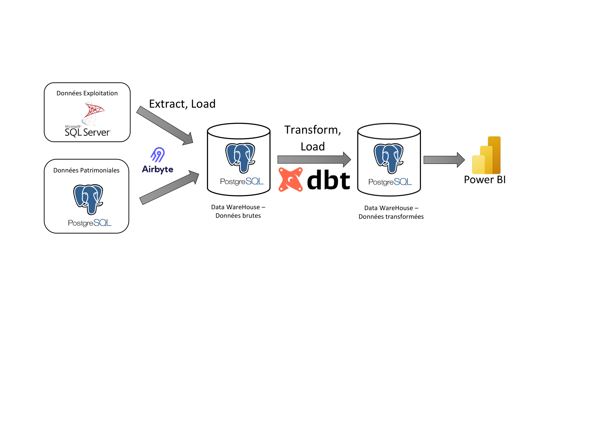
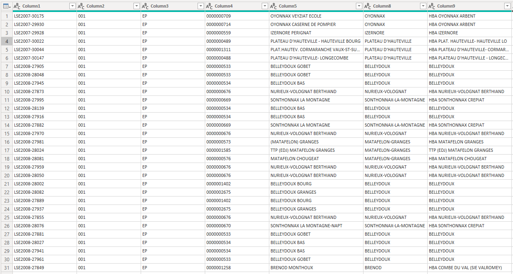
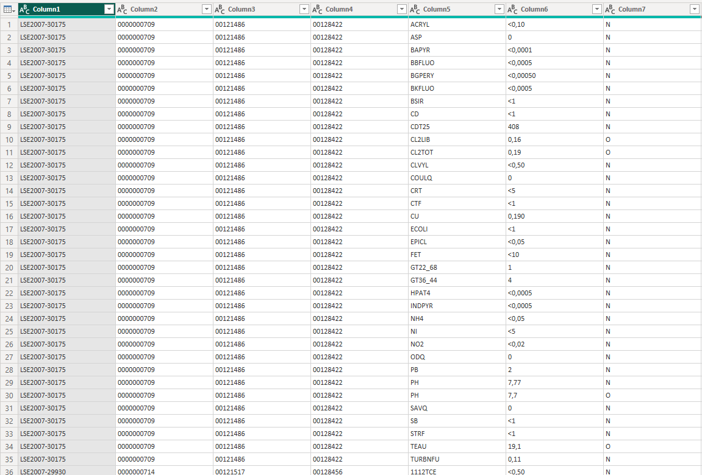
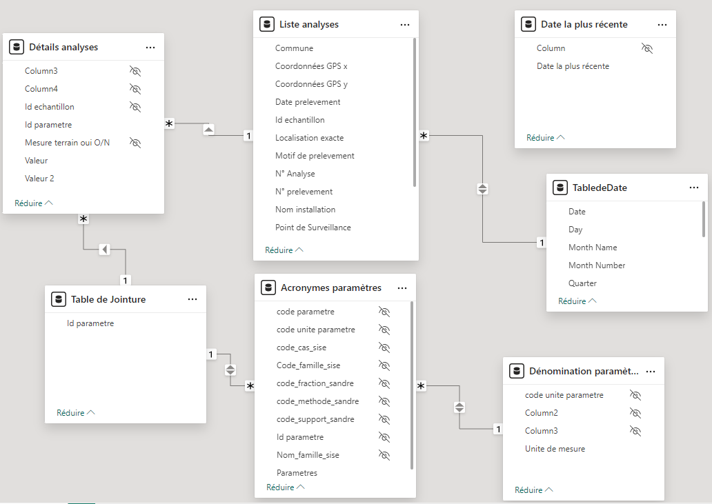
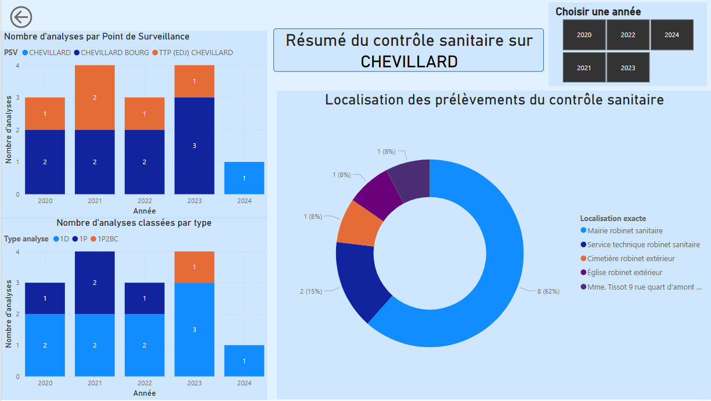
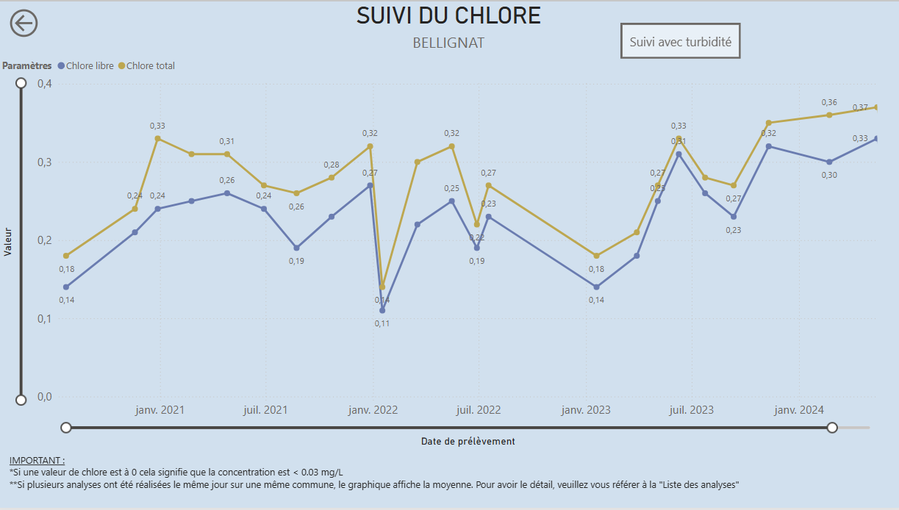

# Portfolio d'Analyse de Données

Bienvenue sur mon portfolio ! Je suis **Nicolas ROUSSET**, **Ingénieur en Gestion des Données et Suivi de la Qualité de l'Eau** chez Haut-Bugey Agglomération.

Mes missions incluent l'ETL des données de différentes sources, le calcul de KPIs et la création de tableaux de bord dynamiques destinés à l'ensemble du service.
Je manipule au quotidien des logiciels comme Excel, AirByte, DBT et PowerBI pour extraire, nettoyer, transformer et présenter des données issues de différentes sources (SQL Server, PostgreSQL, API pour les données externes).

Ce portfolio présente quelques uns de mes projets réalisés dans le domaine de la gestion de l'eau potable, ainsi que mes compétences en outils et techniques d'analyse de données.

---

## 🛠️ **Compétences**
- **Langages** : SQL
- **Outils** :
  - BDD : Microsoft SQL Server, PostGreSQL, Excel
  - RDBMS : SSMS, pgAdmin4
  - ELT : Airbyte + DBT
  - Visualisation : PowerBI

---

## 📊 **Projets**

### 1️⃣ **Suivi des consommations par secteur**

- **Objectifs & Description** :
Mise au point d'un tableau de bord à destination des agents d'exploitation terrain et du Responsable d'Exploitation comprenant :
  - Suivi des débits de nuit par secteur
  - Suivi des débits journaliers par secteur
  - Suivi des rendements par secteur
  - Tableau récapitulatif des variations de consommation par secteur
  - Suivi des débits journaliers par réseau de distribution (comprenant plusieurs secteurs)

Nos données de débits sont issues de notre base de données d'exploitation.
Nos données patrimoniales (secteur, réseau, etc.) sont issues de notre base de données SIG.

- **Données brutes** :

- **Méthodologie** :
  - Connexion aux deux sources de données exploitation (BDD en local) et patrimoniales (BDD serveur distant) avec l'outil AirByte.
  - Automatisation de l'extraction journalière (uniquement nouvelles insertions + modifications) et chargement dans une base de données PostGreSQL en local
  - Utilisation de DBT pour extraire uniquement les données utiles, les nettoyer et les transformer en modèles adaptés aux besoins métiers
  - Les modèles sont stockées sous forme de vues dans une nouvelle base de données PostGreSQL en local
  - Connexion de PowerBI aux vues PostGreSQL pour créer des rapports dynamiques permettant aux utilisateurs de sélectionner les critères d'analyses et d'affichage

- **Outils utilisés** : SSMS, pgAdmin4, Airbyte, DBT, PowerBI

- **Résultat** :
---
### 2️⃣ **Suivi des indicateurs de qualité de l’eau**

- **Objectifs & Description** :
Mise au point d'un tableau de bord à destination des agents d'exploitation terrain et du Directeur du Service des Eaux comprenant :
  - Suivi de la conformité des analyses
  - Suivi de paramètres d'exploitation (concentration en chlore, turbidité, etc.)
  - Traçage des N° de prélèvement, d'échantillon et d'analyse pour retrouver rapidemment l'analyse recherchée
  - Bilan par commune du nombre d'analyses réalisées et des points de prélèvement associés

Intégration et analyse des résultats mensuels des analyses de qualité de l'eau reçus d'un laboratoire d'analyse dans le cadre du contrôle sanitaire national.
Chaque mois, je reçois deux fichiers :
  - La liste des analyses : Ce fichier contient les métadonnées des analyses (dates, communes, etc.).
  - Les résultats des analyses : Ce fichier détaille les résultats pour chaque paramètre analysé, au format SISE-EAUX.

- **Données brutes** :
  - Liste des analyses :
  
  - Résultat des analyses :
  

- **Méthodologie** :
  - Import et transformation des données : Les fichiers sont combinés dans Power BI en utilisant la colonne "id échantillon" comme clé de jointure.
  - Décodage des codes SISE-EAUX : Des tables de correspondance sont utilisées pour transformer les codes SISE-EAUX en libellés compréhensibles.
  - Création de rapports dynamiques : J'ai créé des tableaux de bord dans Power BI où l'utilisateur peut sélectionner les communes et les paramètres à afficher pour visualiser les résultats d'analyses de manière claire et dynamique.

- **Outils utilisés** : PowerQuery, PowerBI

- **Résultat** :
Le rapport final permet aux utilisateurs d'avoir accès à l'ensemble de l'historique des analyses du contrôle sanitaire sur le périmètre de notre collectivité.
Les utilisateurs peuvent filtrer et examiner les analyses de qualité de l'eau pour chaque commune et chaque paramètre, facilitant ainsi la prise de décision et le suivi de la conformité de l'eau potable.

📄 [Voir le rapport complet Power BI](Projets/Controle_Sanitaire.pdf)

---

## 🌐 **Contactez-moi**
- 💼 **LinkedIn** : [Mon profil LinkedIn](https://www.linkedin.com/in/nicolas-rousset-73313467/)
- 🌍 **GitHub** : [Mon GitHub](https://github.com/NicolasRousset)

